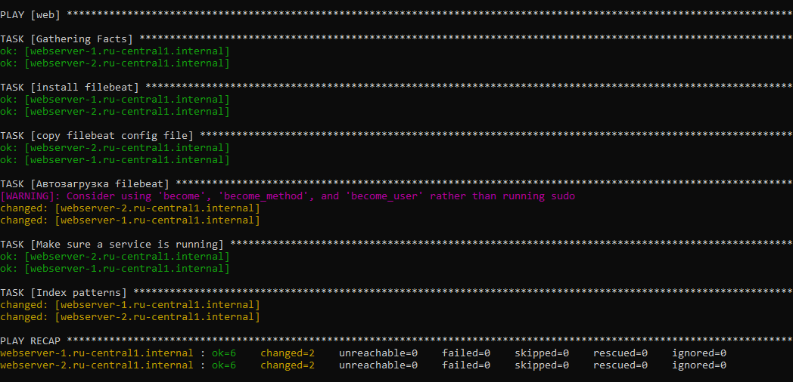

#  Дипломная работа по профессии «Системный администратор»

Содержание
==========
* [Задача](#Задача)
* [Инфраструктура](#Инфраструктура)
    * [Сайт](#Сайт)
    * [Мониторинг](#Мониторинг)
    * [Логи](#Логи)
    * [Сеть](#Сеть)
    * [Резервное копирование](#Резервное-копирование)
    * [Дополнительно](#Дополнительно)
* [Выполнение работы](#Выполнение-работы)
* [Критерии сдачи](#Критерии-сдачи)
* [Как правильно задавать вопросы дипломному руководителю](#Как-правильно-задавать-вопросы-дипломному-руководителю) 

---------

## Задача
Ключевая задача — разработать отказоустойчивую инфраструктуру для сайта, включающую мониторинг, сбор логов и резервное копирование основных данных. Инфраструктура должна размещаться в [Yandex Cloud](https://cloud.yandex.com/) и отвечать минимальным стандартам безопасности: запрещается выкладывать токен от облака в git. Используйте [инструкцию](https://cloud.yandex.ru/docs/tutorials/infrastructure-management/terraform-quickstart#get-credentials).

**Перед началом работы над дипломным заданием изучите [Инструкция по экономии облачных ресурсов](https://github.com/netology-code/devops-materials/blob/master/cloudwork.MD).**

## Инфраструктура
Для развёртки инфраструктуры используйте Terraform и Ansible.  

Не используйте для ansible inventory ip-адреса! Вместо этого используйте fqdn имена виртуальных машин в зоне ".ru-central1.internal". Пример: example.ru-central1.internal  

Важно: используйте по-возможности **минимальные конфигурации ВМ**:2 ядра 20% Intel ice lake, 2-4Гб памяти, 10hdd, прерываемая. 

**Так как прерываемая ВМ проработает не больше 24ч, перед сдачей работы на проверку дипломному руководителю сделайте ваши ВМ постоянно работающими.**

Ознакомьтесь со всеми пунктами из этой секции, не беритесь сразу выполнять задание, не дочитав до конца. Пункты взаимосвязаны и могут влиять друг на друга.

### Сайт
Создайте две ВМ в разных зонах, установите на них сервер nginx, если его там нет. ОС и содержимое ВМ должно быть идентичным, это будут наши веб-сервера.

Используйте набор статичных файлов для сайта. Можно переиспользовать сайт из домашнего задания.

Создайте [Target Group](https://cloud.yandex.com/docs/application-load-balancer/concepts/target-group), включите в неё две созданных ВМ.

Создайте [Backend Group](https://cloud.yandex.com/docs/application-load-balancer/concepts/backend-group), настройте backends на target group, ранее созданную. Настройте healthcheck на корень (/) и порт 80, протокол HTTP.

Создайте [HTTP router](https://cloud.yandex.com/docs/application-load-balancer/concepts/http-router). Путь укажите — /, backend group — созданную ранее.

Создайте [Application load balancer](https://cloud.yandex.com/en/docs/application-load-balancer/) для распределения трафика на веб-сервера, созданные ранее. Укажите HTTP router, созданный ранее, задайте listener тип auto, порт 80.

Протестируйте сайт
`curl -v <публичный IP балансера>:80` 

### Мониторинг
Создайте ВМ, разверните на ней Zabbix. На каждую ВМ установите Zabbix Agent, настройте агенты на отправление метрик в Zabbix. 

Настройте дешборды с отображением метрик, минимальный набор — по принципу USE (Utilization, Saturation, Errors) для CPU, RAM, диски, сеть, http запросов к веб-серверам. Добавьте необходимые tresholds на соответствующие графики.

### Логи
Cоздайте ВМ, разверните на ней Elasticsearch. Установите filebeat в ВМ к веб-серверам, настройте на отправку access.log, error.log nginx в Elasticsearch.

Создайте ВМ, разверните на ней Kibana, сконфигурируйте соединение с Elasticsearch.

### Сеть
Разверните один VPC. Сервера web, Elasticsearch поместите в приватные подсети. Сервера Zabbix, Kibana, application load balancer определите в публичную подсеть.

Настройте [Security Groups](https://cloud.yandex.com/docs/vpc/concepts/security-groups) соответствующих сервисов на входящий трафик только к нужным портам.

Настройте ВМ с публичным адресом, в которой будет открыт только один порт — ssh.  Эта вм будет реализовывать концепцию  [bastion host]( https://cloud.yandex.ru/docs/tutorials/routing/bastion) . Синоним "bastion host" - "Jump host". Подключение  ansible к серверам web и Elasticsearch через данный bastion host можно сделать с помощью  [ProxyCommand](https://docs.ansible.com/ansible/latest/network/user_guide/network_debug_troubleshooting.html#network-delegate-to-vs-proxycommand) . Допускается установка и запуск ansible непосредственно на bastion host.(Этот вариант легче в настройке)

### Резервное копирование
Создайте snapshot дисков всех ВМ. Ограничьте время жизни snaphot в неделю. Сами snaphot настройте на ежедневное копирование.

### Дополнительно
Не входит в минимальные требования. 

1. Для Zabbix можно реализовать разделение компонент - frontend, server, database. Frontend отдельной ВМ поместите в публичную подсеть, назначте публичный IP. Server поместите в приватную подсеть, настройте security group на разрешение трафика между frontend и server. Для Database используйте [Yandex Managed Service for PostgreSQL](https://cloud.yandex.com/en-ru/services/managed-postgresql). Разверните кластер из двух нод с автоматическим failover.
2. Вместо конкретных ВМ, которые входят в target group, можно создать [Instance Group](https://cloud.yandex.com/en/docs/compute/concepts/instance-groups/), для которой настройте следующие правила автоматического горизонтального масштабирования: минимальное количество ВМ на зону — 1, максимальный размер группы — 3.
3. В Elasticsearch добавьте мониторинг логов самого себя, Kibana, Zabbix, через filebeat. Можно использовать logstash тоже.
4. Воспользуйтесь Yandex Certificate Manager, выпустите сертификат для сайта, если есть доменное имя. Перенастройте работу балансера на HTTPS, при этом нацелен он будет на HTTP веб-серверов.

## Выполнение работы
На этом этапе вы непосредственно выполняете работу. При этом вы можете консультироваться с руководителем по поводу вопросов, требующих уточнения.

⚠️ В случае недоступности ресурсов Elastic для скачивания рекомендуется разворачивать сервисы с помощью docker контейнеров, основанных на официальных образах.

**Важно**: Ещё можно задавать вопросы по поводу того, как реализовать ту или иную функциональность. И руководитель определяет, правильно вы её реализовали или нет. Любые вопросы, которые не освещены в этом документе, стоит уточнять у руководителя. Если его требования и указания расходятся с указанными в этом документе, то приоритетны требования и указания руководителя.

## Критерии сдачи
1. Инфраструктура отвечает минимальным требованиям, описанным в [Задаче](#Задача).
2. Предоставлен доступ ко всем ресурсам, у которых предполагается веб-страница (сайт, Kibana, Zabbix).
3. Для ресурсов, к которым предоставить доступ проблематично, предоставлены скриншоты, команды, stdout, stderr, подтверждающие работу ресурса.
4. Работа оформлена в отдельном репозитории в GitHub или в [Google Docs](https://docs.google.com/), разрешён доступ по ссылке. 
5. Код размещён в репозитории в GitHub.
6. Работа оформлена так, чтобы были понятны ваши решения и компромиссы. 
7. Если использованы дополнительные репозитории, доступ к ним открыт. 

## Как правильно задавать вопросы дипломному руководителю
Что поможет решить большинство частых проблем:
1. Попробовать найти ответ сначала самостоятельно в интернете или в материалах курса и только после этого спрашивать у дипломного руководителя. Навык поиска ответов пригодится вам в профессиональной деятельности.
2. Если вопросов больше одного, присылайте их в виде нумерованного списка. Так дипломному руководителю будет проще отвечать на каждый из них.
3. При необходимости прикрепите к вопросу скриншоты и стрелочкой покажите, где не получается. Программу для этого можно скачать [здесь](https://app.prntscr.com/ru/).

Что может стать источником проблем:
1. Вопросы вида «Ничего не работает. Не запускается. Всё сломалось». Дипломный руководитель не сможет ответить на такой вопрос без дополнительных уточнений. Цените своё время и время других.
2. Откладывание выполнения дипломной работы на последний момент.
3. Ожидание моментального ответа на свой вопрос. Дипломные руководители — работающие инженеры, которые занимаются, кроме преподавания, своими проектами. Их время ограничено, поэтому постарайтесь задавать правильные вопросы, чтобы получать быстрые ответы :)

# Реализация

## Terraform

Для удобства реализации и настройки инфраструктуры вся конфигурация была разбита на отдельные сгруппированные по функция и назначению файлы:

1. Настройка виртуальных машин:
  -`bastion.tf` - сервер реализующий концепцию bastionhost, выступает в роли точки доступа к прочим серверам
  -`elasticsearch.tf` - хранение и обработка логов
  -`kibana.tf` - отображение логов
  -`webservers.tf` - вебсервера
  -`zabbix.tf` - сервер системы мониторинга
2. Настройка сети
  -`network.tf` основной файл конфигурации сети и подсетей
  -`securitygroups.tf` файл конфигурации групп доступа для настройки правил обмена трафиком
3. Файлы конфигурации провайдера и дополнительной остнастки
  -`main.tf` конфигурация основных датасторов
  -`providers.tf` конфигурация провайдера
  -`outputs.tf` вывод адресов северов
  -`variables.tf` спомогатльные переменные

После валидации и применения написанной конфигурации получилась следующая структура серверов:

## Network

Для разграничения доступности серверов были созданы две подсети приватная и публичная. Сервера публичной сети доступны извне и имеют свои публичные адреса.
Это сервера zabbix, kibana и bastion. Остальные сервера не доступны из публичной сети, но могут общаться между собой согласно настройкам групп доступа.
Сервера в приватной группе могут принимать трафик только из описанных CIDR источников "10.0.1.0/28", "10.0.2.0/28", "10.0.3.0/28", "10.0.4.0/28".
Для бастион зоста открыт только 22 порт для подключения по SSH.
Для kibana и zabbix отрыты только необходимые для их работы порты. Для zabbix 8080 для доступа к веб интерфейсу, 10050 и 10051 для получения сообщений от агентов.

Веб сервера были добавлены в отдельные подгруппы дял разделения по разным зонам доступности и обьединены в одну целевую группу и добавлены в группу бекэндов чтобы балансировщик мог отслеживать состояние хостов и производил балансировку соответсвующим образом. Для настройки мрашрутизации был добавлен HTTP-роутер.

## Ansible

Благодаря использованию концепции bastionhost получилось произвести установку необходимых пакетов и настройку конфигов виртуальных машин без необходимости прямого подключения к ним. Для этого при создании виртульных машин в cloud-config были добавлены стандартный пользователь и публичный ключ для подключения. Поэтому  Ansible был установлен на локальной машине с линукс а подклбчение к виртуальным машинам производилось через bastion host с помощью ProxyCommand.

Для подлючения к виртуальным машинам, из выходных параметров после выполнения комманды `terraform apply`, был автоматически сформирован `inventory.ini` содержащий FQDN адреса.

Ping ansible

Конфигурация Ansible так же была заделена на отдельный файлы. Их можно разделить на две группы: конфигурация серверов и конфигурация вспомогательных агентов.

Для каждого из серверов били подготовлены файлы конфигурации и yaml файл с описанием заданий которые необходимо выполнить для успешной настройки. В случае с вебсерверами nginx конфигурация была применена одноверменно для обоих серверов (благодаря группе `web` в файле `inventory.ini` и шаблону настроек), так как ожидается что их содержимое будет идентичным.

В качестве вспомогательных агентов были установлены инастроены zabbix-agent-ы для собра мониторинга со всех серверов. 

Также для сбора логов на вебсервера был установлен filebeat бля отправки в ELK логов получаемых от nginx. Настройка агентов так же производилась для группы хостов одновременно.
Лог настроки filebeat

kibana
[http://158.160.165.166:5601](http://158.160.165.166:5601/app/dashboards#/view/b9728e20-f779-11ee-a736-c144fb596b12)

Логи

Zabbix (логин/ пароль стандартные Admin/zabbix)
[http://158.160.161.63:8080](http://158.160.161.63:8080/zabbix.php?action=dashboard.view&dashboardid=1)

## Server

В качестве веб сервера использовался nginx. Для его конфигурации использовались стандартные настройки. Но так как в настройках сети были устанволены healthcheck в файл access.log постоянно попадали записи о проверке доступности. Чтобы избежать черезмерного увеличения размера access.log и захламления ELK в конфиг nginx была добавлена условная конструкция для фильтрации таких логов.  

Статичный сайт расположен по адресу (это адрес балансировщика)
[http://158.160.130.76](http://158.160.130.76)

## Snaphot

Для настроки резервного копирвоания в облаке яндекса использовался ресурс `yandex_compute_snapshot_schedule`. Он позволяет посредством выражений cron задаватьрасписание дял резервного копиравания указанных ресурсов. Id дисков получаются из соответсвующих ресурсов виртуальных серверов, из-за этого после каждого разворачивания инфраструктуры будут указаны правильные Id дисков. Конфигурация Terraform для создания резервных копий представлена в файле `snapshot.tf`

Сделанные резерные копии

Расписание

## Итоги

В результате выполения задания удалось получить базовую отказоустойчивую инфраструктуру в облаке. Использование Terraform и Ansible позволило максимально упростить и автоматизировать процесс разворачивания и настройки вебсерверов, систем мониторинга и логгировоания.
